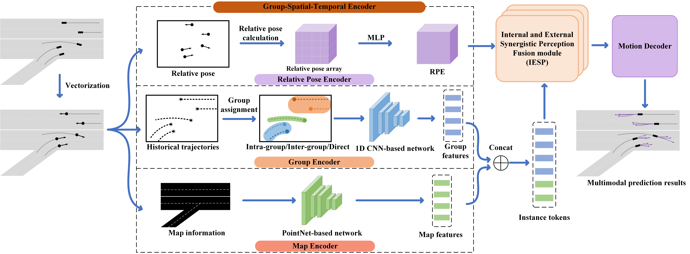

# GSTEP
<br/>

> Trajectory Prediction Based on Grouped Spatial-Temporal Encoder (Paper and Codes Coming Soon ~) 

<p align='center'>

</p>

## Getting Started
Please refer to [Gettting_Started.md](docs/Gettting_Started.md).


## Acknowledgement

Our code is heavily based on [SIMPL](https://github.com/Nicer030/GSTEP/edit/main/). Thanks their awesome codebase.


## Citation

If you find this project useful in your research, please consider cite:
```

```
